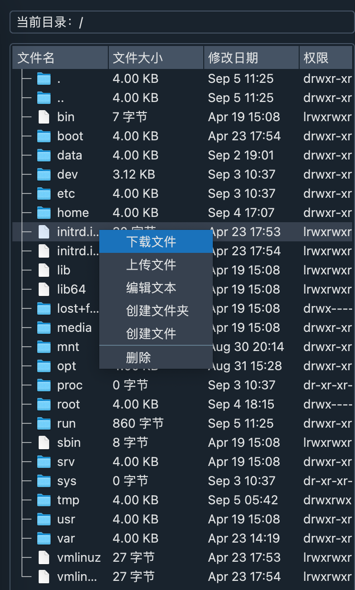
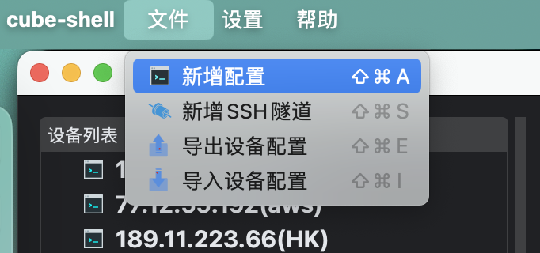
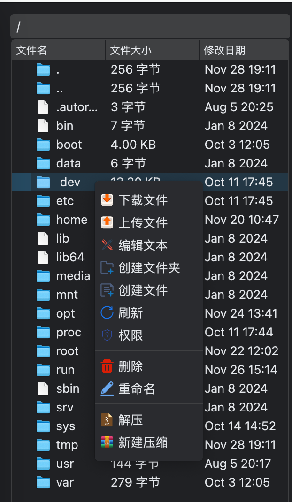
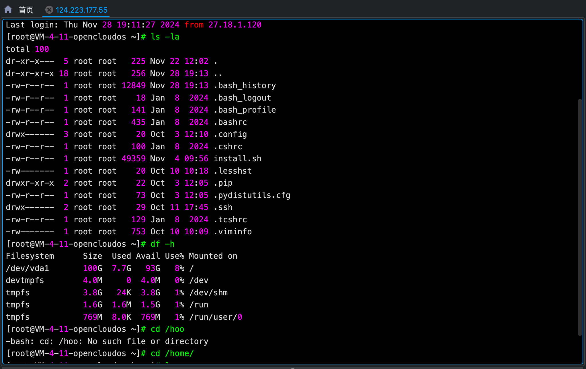
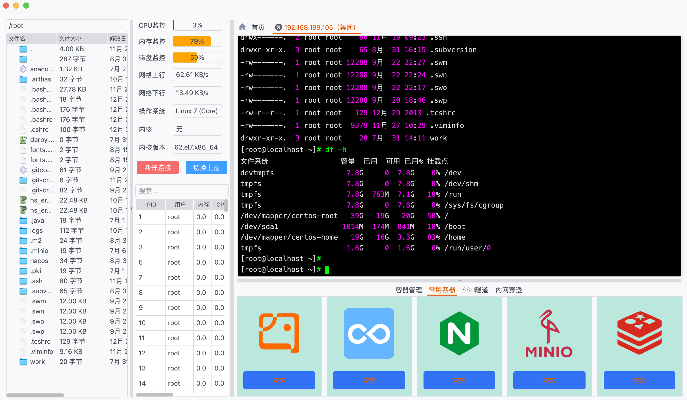
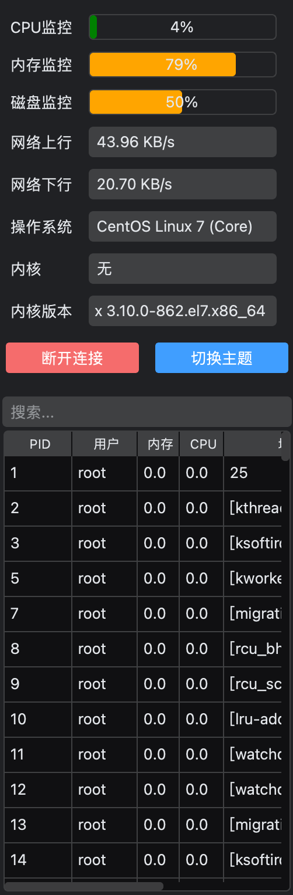
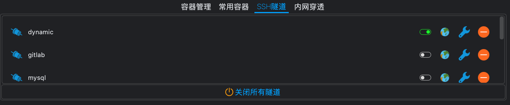
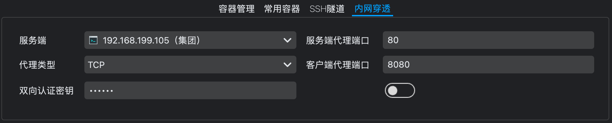
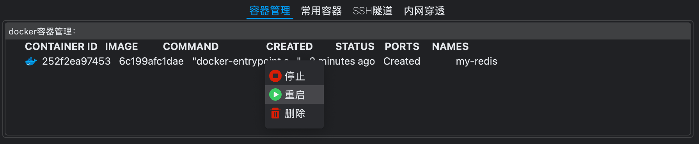

## cube-shell

#### 介绍


`cube-shell`是`linux` 服务器远程运维管理工具，可以代替Xshell、XSftp、MobaXterm 等工具对服务器进行管理，`cube-shell` 简洁且强大。市面上大多数ssh客户端工具都是集成了很多没有用的菜单，而且ui设计十分复杂，对于初用者不太友好。

`cube-shell`的设计初衷就是简洁且实用，没有任何多余的菜单干扰我们使用它。安装也很简单，解压不需要安装，就可以直接使用。

### cube-shell有哪些功能？
**1.设备列表**



- 新增配置
- 编辑配置
- 删除配置

**2.快捷菜单栏**

每个菜单栏都支持快捷键

- 新增配置
- 新增SSH隧道
- 导出设备配置
- 导入设备配置


**3.支持sftp协议对文件的操作**

下载文件（支持批量下载）
- 上传文件（支持批量上传）
- 编辑文件
- 创建文件夹
- 创建文件
- 刷新（新增功能）
- 删除文件和文件夹（支持批量删除）

**4.支持ssh协议远程操作linux系统**


- 可以进行终端操作
- 支持多标签（支持相同服务器）
- 支持标签拖动顺序
- 支持复制、粘贴、清屏
- 代码高亮显示
- 支持切换终端主题
- 支持命令行补全功能
- 支持多标签之间终端和`sftp`文件区域联动


**5.主题切换**

`cube-shell 1.5.x`版本优化了具有现代化IDE风格的整体主题背景切换，依然支持两种主题切换，暗主题和亮主题两种



**6.状态栏**


- CPU 监控
- 内存监控
- 磁盘监控
- 网络上行
- 网络下行
- 操作系统
- 内核
- 内核版本
- 进程管理（支持快速kill进程，支持进程搜索）

**7.扩展功能区**
- SSH隧道功能
  
- 内网穿透功能
  
- 容器管理功能
  
- 常用容器功能
  


### 软件架构
`cube-shell`主要使用`python`语言开发。

主要使用技术：
|   名字  |  版本   |  描述   |
| --- | --- | --- |
|  Python   |  3.11.9   |     |
|  PySide6  |  6.7.2   |  是C++ Qt 的Python语言绑定，支持跨平台   |
|  paramiko   |  3.4.0   |  是python的操作ssh协议和sftp协议的第三方库   |
|  Pygments   |   2.18.0  |  是python代码高亮的常用库   |
|  pyqtdarktheme   |   2.1.0  |  是Qt现代主题库   |
|  deepdiff   |   8.0.1  |  python深度文件比对库   |
|  pyte   |   0.8.2  |  Linux终端数据流框架   |
|  frp   |   0.61.0  |  内网穿透套件   |

**图标主要来源以下两个图标库：**

`https://icons8.com/icons/color`

`https://www.iconfont.cn/`

#### 安装教程
可以下载最新版本发行版应用程序，也可以下载源代码自行编译。

`cubeShell 1.5.x`版本采用`Nuitka`进行编译，这样可以直接把`python`代码转成`c++`代码，然后直接编译成二进制文件，性能比之前提升了50%左右，包大小减少了40%左右。在编译之前首先要保证机器上要安装`python`环境，并安装相应的依赖包。

##### 编译windows 程序
1.  安装环境
``` python
pip install pipenv
```
2.  下载依赖
``` python
//切换虚拟环境
pipenv shell
//安装依赖
pipenv install
```
3. 编译
```
build-exe.bat
```
4. 打包exe 安装包
```
deploy-install.bat
```
##### 编译Mac程序
1.  安装环境
``` python
pip install pipenv
```
2.  下载依赖
``` python
//切换虚拟环境
pipenv shell
//安装依赖
pipenv install
```
3.  编译打包
```
chmod +x app.sh && ./app.sh
```

#### 参与贡献
欢迎各位朋友积极参与代码贡献。

1.  Fork 本仓库
2.  新建 Feat_xxx 分支
3.  提交代码
4.  新建 Pull Request

#### 视频教程地址
[cube-shell-video](https://mp.weixin.qq.com/s/ntDuDipnCqN4v2Y4Urzo6w)

#### 有任何不懂的可以加交流群

